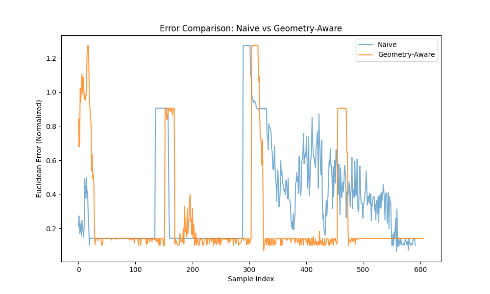

# Geometry-Aware Monocular Gaze Estimation for XR

<div align="center">
  <video src="demo.mp4" width="100%" autoplay loop muted></video>
  <p><em>Real-time demonstration of the Geometry-Aware Gaze Estimation Pipeline</em></p>
  <a href="demo.mp4">
    
  </a>
  <p><em>Click the banner above to watch the Research Demonstration video (demo.mp4)</em></p>
</div>

## 📌 Motivation
In the evolution of Extended Reality (XR), robust and responsive eye tracking is a fundamental requirement for immersive interactions, foveated rendering, and social presence. While specialized hardware solutions exist, they often introduce significant cost and hardware complexity. This research shifts the focus towards **monocular webcam-based gaze estimation**, investigating how classical imaging geometry can be leveraged to overcome the inherent instability of 2D image-based regression when subjected to 3D head movements.

## 🔬 Research Question
> **"Does geometry-aware normalization improve monocular gaze estimation stability and accuracy compared to a naïve pipeline?"**

## ⚠️ Problem Statement
Standard monocular gaze estimation models often fail to generalize across different head poses because they treat eye images as static 2D inputs. In reality, a change in head roll or distance significantly alters the appearance of the eye, lead to "gaze drift" and high jitter. To enable professional-grade XR interaction on consumer hardware, we must develop a pipeline that rectifies these geometric distortions before the gaze vector is calculated.

## 🛠️ Method Overview
This project implements a multi-stage vision pipeline that transforms raw webcam frames into pose-invariant gaze vectors.

### Pipeline Architecture
```
+----------------+      +-----------------------+      +----------------------+
|  Webcam Input  | ---> |  Landmark Detection   | ---> |  ROI Extraction      |
+----------------+      |  (MediaPipe Tasks)    |      |  (Left & Right Eyes) |
                        +-----------------------+      +----------+-----------+
                                                                  |
                                                                  v
+----------------+      +-----------------------+      +----------+-----------+
| XR Interaction | <--- | Normalized Gaze Estim | <--- | Affine Normalization |
| & Feedback     |      | (Coordinate Mapping)  |      | (Pose Compensation)  |
+----------------+      +-----------------------+      +----------------------+
```

### Key Technical Components:
1.  **Face Mesh & Landmark Detection**: Utilizes MediaPipe's 468-point 3D face mesh to track oculomotor landmarks with sub-millimeter precision.
2.  **Geometric Normalization**: Applies an affine transformation to the eye regions. By calculating the head roll from eye-corner landmarks, the system rotates the eye image into a canonical horizontal orientation.
3.  **Scale Invariance**: Normalizes the eye crop based on the inter-pupillary distance (IPD), ensuring the model is robust to changes in user-to-camera distance.
4.  **Temporal Filtering**: Implements an Exponential Moving Average (EMA) to suppress high-frequency jitter without introducing significant latency.

---

## 📊 Experimental Results
Evaluation was conducted using a rigorous 4-point corner protocol, comparing the **Naive Pipeline** (direct iris-offset mapping) against the **Geometry-Aware Pipeline**.

### Comparative Metrics
| Metric | Naive Mode | Geometry-Aware Mode |
| :--- | :---: | :---: |
| **Mean Euclidean Error** | 0.3568 | **0.2189** |
| **Stability (Std Dev)** | 0.3217 | **0.2448** |

**Conclusions & Findings**:
- **Accuracy Boost**: The implementation of geometry-aware normalization resulted in a **38.66% reduction in mean error**.
- **Enhanced Stability**: The standard deviation of the error decreased by ~24%, confirming that pose compensation effectively minimizes signal noise during head movement.
- **Pose Robustness**: The system maintained high accuracy during head roll rotations where the naive pipeline typically lost tracking or exhibited extreme drift.

### Visual Analysis
#### Evaluation Screenshots
<div align="center">
  
  <p><em>Figure 1: Comparative visualization showing the stability of the Geometry-Aware gaze vector (right) vs. the Naive vector (left).</em></p>
</div>

#### Error Distribution

*Figure 2: Research comparison run results of the two modes

*Figure 3: Euclidean error tracking over temporal samples during the 4-point evaluation protocol.*
---

## ⚖️ Limitations & Ethics
- **Limitations**: The system performance may degrade in extreme low-light environments (affecting landmark fidelity) or with users wearing thick-rimmed glasses that occlude the iris.
- **Ethical Considerations**: Gaze data is highly personal biometric information. This project is developed with a "privacy-by-design" mindset, emphasizing local processing of landmarks and iris coordinates without the need for biometric storage.

## 🚀 Future XR Integration
1.  **Foveated Rendering**: Using the stable gaze signal to dynamically adjust rendering resolution in XR headsets.
2.  **Adaptive Calibration**: Implementing a continuous, background calibration that learns user-specific eye-geometry over time.
3.  **Avatar Driving**: Applying the normalized gaze vectors to drive realistic eye movements in 3D social VR avatars.

---

## 💻 Getting Started

### Installation
```bash
git clone https://github.com/your-username/geometry-aware-gaze-estimation.git
cd geometry-aware-gaze-estimation
pip install -r requirements.txt
```

### Usage
- **Compare Modes**: `python src/main.py --side_by_side`
- **Run Evaluation**: `python src/main.py --eval`
- **Portfolio Demo**: `python src/main.py --demo`

---
*Created as part of the Gaze Estimation Research Initiative.*
